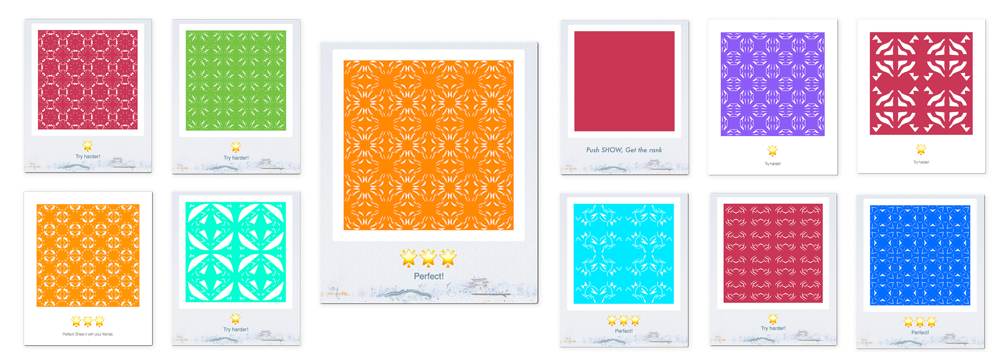

# Papercutting

## Introduction

Papercutting is a kind of folk art in China that uses scissors or a knife to cut patterns on paper. When I was a kid, our teachers used papercutting works as rewards. Every time during the Chinese New Year, the Chinese will post window papercutting, which is also a kind of papercutting art, as decorations to accentuate the New Year's atmosphere.

For me, paper-cutting is a unique memory, a memory that children receive praise from the teacher, and a memory of family reunion.

In the Papercutting, I use AppKit, Vision, SpriteKit, AVFoundation and PlaygroundSupport.

I use the NSView to realize the function of simulating folding paper and cutting paper. At the same time, I use NSTouchBarDelegate to implement the buttons on the touch bar. I use AppKit to implement some other functions, such as keyboard shortcuts, mouse clicks and drags.

SpriteKit is used to build the main interface of Papercutting. I also use it to achieve some animations. For example, in the start interface, the cut paper will split into two halves and fly out. There will also be some text fading in and out using Spritekit.

I also used Vision to compare the similarity between the pattern cut by the user and the preset pattern to give a rating. AVFoundation is used to play and pause background music.

## Papercutting skills

### Folding

We can fold the paper and use symmetrical beauty to cut out various patterns.

### Cutting

There are two ways to cut paper. Yin carving is to engrave the outline lines that represent the structure of objects. Contrary to Yin carving, Yang carving is to cut away the blank part and keep the outline.

## Beyond WWDC20

> If you've shared or considered sharing your coding knowledge and enthusiasm for computer science with others, let us know.

I am now a junior student majoring in CS. I want to change the status that many students studying CS don’t like coding. I found that in China, many students learning CS do not like coding very much, they are more focused on algorithms and some very theoretical knowledge. When it comes to the requirements  to write large-scale projects, they are usually powerless. 

This is because we did not really enjoy coding when we were in freshman year, and cultivated the habit of coding. Instead, we are more focused on how to use recursive to dazzle techniques in C.

At the beginning of learning coding, we need to enjoy coding, and get used to coding. I did a project called Cuser. When we were studying the development of STC, I saw that the students around were confused about the hardware development and their experience was extremely poor. So I made this simple project. In this project, through the communication between the PC/Mac and board, we can use Python to simply write a few codes to achieve a variety of functions on our development board. This allows beginners to feel the fun of hardware development, instead of falling into the ocean of hardware development at the beginning, and even drowning in the water.

Swift is also a good way for novices to enjoy coding. It allows us to feel the code we have written in some visual ways. In this challenge, I feel the playground ’s friendliness to novices. I seldom use Swift before. Through the documents provided by apple, I can easily build a simple game in playground.

After we have some interest in coding, some more in-depth theoretical knowledge is also necessary, such as computer architecture, compiler, operating system, and so on. In our school, I usually use a lot of pictures and examples to explain some more in-depth principles to my classmates, and sometimes use some real-life examples as a comparison.

At the same time, many universities also provide good online courses, but the video and text resources of these courses are often in English. While many Chinese students have difficulty understanding English resources. I also participated in the translation of CSAPP course videos before. This project is also supported by the CSAPP course group. The videos we translated can be seen on Github and Bilibili.

Finally, I plan to establish a club in our school in my senior year. I want to take everyone to \'play\' Siwft and enjoy coding together.
